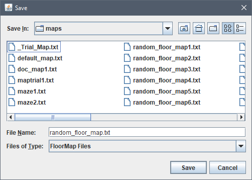
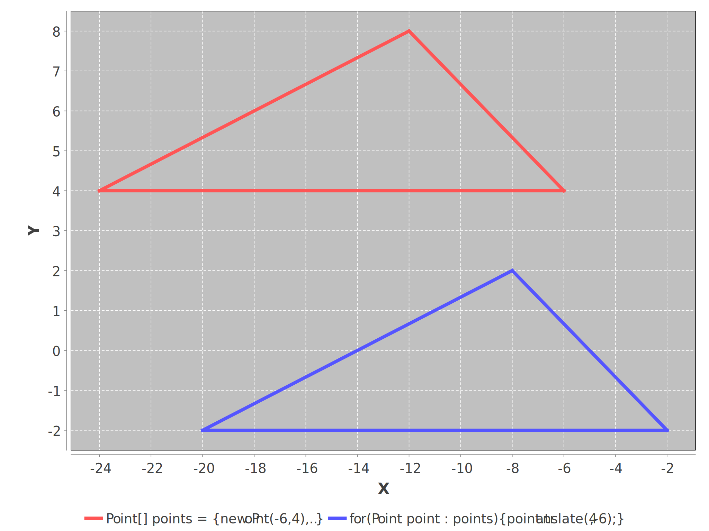
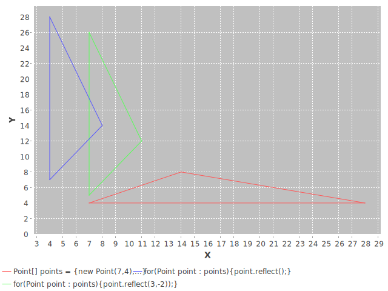
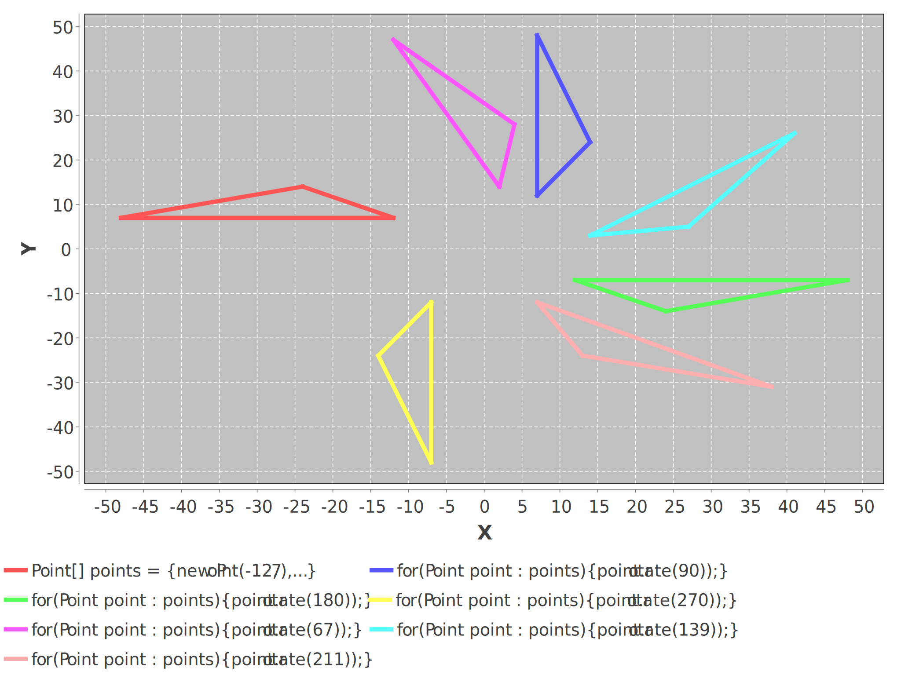
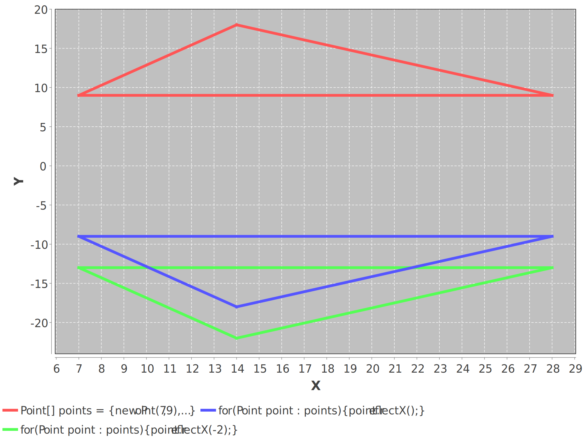
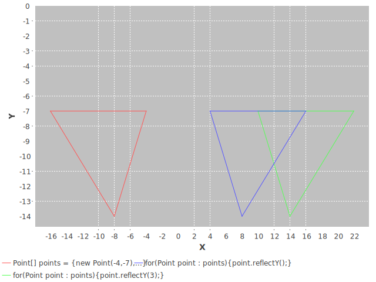

# Solver

An XY Point Class, ANSI text floor map generator and BFS maze solver.

This package runs under Java 8.

Dependencies: None, except during testing.

TestPoint and ChartIt use [JFreeChart](https://mvnrepository.com/artifact/org.jfree/jfreechart/1.5.3), [JCommons](https://mvnrepository.com/artifact/org.jfree/jcommon/1.0.24), and [JFreeSVG](https://mvnrepository.com/artifact/org.jfree/jfreesvg/3.4).

These dependencies are used for testing only, and not required to use the package.

## Sample random floor map creation:

```
solver.CreateMap.main();

Width = 18 Height = 13
------------------
|                |
|   *       *    |
|   *  * *  *    |
|   *    * **    |
|  ***   *  *    |
|        *  *P*  |
|        *  *    |
|        *  *  * |
|   K    *  *    |
|        *  * D  |
|        *  *    |
------------------
```




## Sample floor map solver solution:

```
solver.SolveMap.main(random_floor_map.txt);
------------------
|     ........   |
|   * .     *.   |
|   * .* *  *.   |
|   * .  * **.   |
|  ***.  *  *.   |
|   ...  *  *P*  |
|   .    *  *..  |
|   .    *  * .* |
|   K    *  * .  |
|        *  * D  |
|        *  *    |
------------------

Kiva Commands:
FFFRFFLFFFFFRFFFFFFFRFFFFFTFLFRFFFD

Process finished with exit code 0
```

The robot (Kiva) gets a pod at point P and drops it off at the drop zone D.

## Sample maze solver solution:

```
solver.SolveMap.main(maze1.txt)

----------
|K....   |
| ***.** |
| * .. * |
| * .* * |
| **.****|
| * ..   |
| * *. * |
|****.***|
|   *...P|
| *    * |
----------

Process finished with exit code 0
```

## Point Tests:

### Constructors

```java
********** POINT TESTS **********

a = 6, b = 3

********** TEST CONSTRUCTORS **********

Point origin = new Point();
Expect (0,0) 
Result (0,0)

Point point = new Point(6,3);
Expect (6,3) 
Result (6,3)

point.getReference(); // Reference is null.
Expect null 
Result null

Point pointWithReference = new Point(6,3,origin);
Expect (6,3) 
Result (6,3)
Point pointWithReference.getReference();
Expect (0,0) 
Result (0,0)

point.getX(); point.getY();
Expect 6,3 
Result 6,3 

Point p = new Point(6,3);
Point q = new Point(12,9);
Point d1 = p.getDelta(q);
Expect (6,6) 
Result (6,6)

Point d2 = new Point().getDelta(p,q);
Expect (6,6) 
Result (6,6)


Process finished with exit code 0
    
    
```

### Setters

```java
********** POINT TESTS **********

a = -6, b = -3

********** TEST SETLOCATION, SETX, SETY SETREFERENCE **********

Point point = new Point(-6,-3);
Expect (-6,-3) 
Result (-6,-3)

Point q = new Point(-12,-6);
Expect (-12,-6) 
Result (-12,-6)

q.setLocation(point);
Expect (-6,-3) 
Result (-6,-3)

point.setLocation(-12,-6);
Expect (-12,-6) 
Result (-12,-6)

point.setReference(a,b);
Expect [(-12,-6),(-6,-3)] 
Result [(-12,-6),(-6,-3)]

q.setReference(point);
Expect [(-12,-6),(-6,-3)] 
Result [(-12,-6),(-6,-3)]

point.setX(-6); 
point.setY(-3);
Expect (-6,-3) 
Result (-6,-3)


Process finished with exit code 0
```

### Translate


* Translates this Point, at location `(x,y)`, by `a` along the x-axis and `b` along the y-axis so that it now represents the Point `(x+a,y+b)`.




```java
********** POINT TESTS **********

a = -6, b = 4

********** TEST TRANSLATE, MOVE, MOVEBY  **********

Point point = new Point(-6,4);
Expect (-6,4) 
Result (-6,4)

point.translate(-6,4);
Expect (-12,8) 
Result (-12,8)

Point q = new Point(-6,4);
Expect (-6,4) 
Result (-6,4)

point.translate(q);
Expect (-12,8) 
Result (-12,8)

point.move(-6,4);
Expect (-6,4) 
Result (-6,4)

Point r = point.moveBy(-6,4);
Expect (-6,4) 
Result (-6,4) (point)
Expect (-12,8) 
Result (-12,8) (r)

Point s = point.moveBy(q);
Expect (-6,4) 
Result (-6,4) (point)
Expect (-12,8) 
Result (-12,8) (s)

Point[] points = {new Point(-6,4),
                new Point(-12,8),
                new Point(-24,4),
                new Point(-6,4)};
Expect [(-6,4), (-12,8), (-24,4), (-6,4)] 
Result [(-6,4), (-12,8), (-24,4), (-6,4)]

for(Point point : points){
    point.translate(4,-6);
}
Expect [(-2,-2), (-8,2), (-20,-2), (-2,-2)] 
Result [(-2,-2), (-8,2), (-20,-2), (-2,-2)]


Process finished with exit code 0
```

### Reflect

* Reflects of the Point `(x,y)` across the line `y = x`, reversing the `(x,y)` coordinate values to `(y,x)`.

Note: This method can convert `(row,col)` in an `array[][]` to `(x,y)`.



```java
        ********** POINT TESTS **********

        a = 7, b = 4

        ********** TEST REFLECT **********

        Point point = new Point(7,4);
        Expect (7,4)
        Result (7,4)

        point.reflect();
        Expect (4,7)
        Result (4,7)

        point.getReference();
        Expect (7,4)
        Result (7,4)

        Point[] points = {new Point(7,4),
                        new Point(14,8),
                        new Point(28,4),
                        new Point(7,4)};
        Expect [(7,4), (14,8), (28,4), (7,4)]
        Result [(7,4), (14,8), (28,4), (7,4)]

        for(Point point : pointsArray){
            point.reflect();
        }
        Expect [(4,7), (8,14), (4,28), (4,7)]
        Result [(4,7), (8,14), (4,28), (4,7)]

        for(Point point : pointsArray){
            point.reflect(7);
        }
        Expect [(-3,14), (1,21), (-3,35), (-3,14)]
        Result [(-3,14), (1,21), (-3,35), (-3,14)]

        for(Point point : pointsArray){
            point.glide(7,4);
        }
        Expect [(11,11), (15,18), (11,32), (11,11)]
        Result [(11,11), (15,18), (11,32), (11,11)]


        Process finished with exit code 0


```

### Rotate

* Rotates the Point `(x,y)` by angle `theta` (in degrees) centered on the origin `(0,0)`.



```java
********** POINT TESTS **********

a = 1, b = 7

********** TEST ROTATE **********

Point point = new Point(-12,7);
Expect (-12,7) 
Result (-12,7)

point.rotate(90);
Expect (7,12) 
Result (7,12)

point.rotate(180);
Expect (-7,-12) 
Result (-7,-12)

point.rotate(270);
Expect (12,-7) 
Result (12,-7)

Point[] points = {new Point(-12,7),
                new Point(-24,14),
                new Point(-48,7),
                new Point(-12,7)};
Expect [(-12,7), (-24,14), (-48,7), (-12,7)] 
Result [(-12,7), (-24,14), (-48,7), (-12,7)]

for(Point point : pointsArray){
    point.rotate(90);
}
Expect [(7,12), (14,24), (7,48), (7,12)] 
Result [(7,12), (14,24), (7,48), (7,12)]

for(Point point : pointsArray){
    point.rotate(180);
}
Expect [(12,-7), (24,-14), (48,-7), (12,-7)] 
Result [(12,-7), (24,-14), (48,-7), (12,-7)]

for(Point point : pointsArray){
    point.rotate(270);
}
Expect [(-7,-12), (-14,-24), (-7,-48), (-7,-12)] 
Result [(-7,-12), (-14,-24), (-7,-48), (-7,-12)]


Process finished with exit code 0
```

### ReflectX

* Reflects of the Point `(x,y)` across a horizontal line, transforming the `y` coordinate across the line equidistant.

* `@param b` - integer, the `y` location of the horizontal line. Origin, `(0)` is used if no parameter is provided.



```java
********** POINT TESTS **********

a = 7, b = 9

********** TEST REFLECTX **********

Point point = new Point(7,9);
Expect (7,9) 
Result (7,9)

point.reflectX();
Expect (7,-9) 
Result (7,-9)

point.getReference();
Expect (7,9) 
Result (7,9)

Point[] points = {new Point(7,9),
                new Point(14,18),
                new Point(28,9),
                new Point(7,9)};
Expect [(7,9), (14,18), (28,9), (7,9)] 
Result [(7,9), (14,18), (28,9), (7,9)]

for(Point point : pointsArray){
    point.reflectX();
}
Expect [(7,-9), (14,-18), (28,-9), (7,-9)] 
Result [(7,-9), (14,-18), (28,-9), (7,-9)]

for(Point point : pointsArray){
    point.reflectX(-2);
}
Expect [(7,-13), (14,-22), (28,-13), (7,-13)] 
Result [(7,-13), (14,-22), (28,-13), (7,-13)]


Process finished with exit code 0
```

### ReflectY

* Reflects of the Point `(x,y)` across a vertical line, transforming the `x` coordinate across the line equidistant.

* `@param a` - integer, the `x` location of the horizontal line. Origin, `(0)` is used if no parameter is provided.



```java
********** POINT TESTS **********

a = 9, b = 3

********** TEST REFLECTY **********

Point point = new Point(-4,-7);
Expect (-4,-7) 
Result (-4,-7)

point.reflectY();
Expect (4,-7) 
Result (4,-7)

point.getReference();
Expect (-4,-7) 
Result (-4,-7)

Point[] points = {new Point(-4,-7),
                new Point(-8,-14),
                new Point(-16,-7),
                new Point(-4,-7)};
Expect [(-4,-7), (-8,-14), (-16,-7), (-4,-7)] 
Result [(-4,-7), (-8,-14), (-16,-7), (-4,-7)]

for(Point point : pointsArray){
    point.reflectY();
}
Expect [(4,-7), (8,-14), (16,-7), (4,-7)] 
Result [(4,-7), (8,-14), (16,-7), (4,-7)]

for(Point point : pointsArray){
    point.reflectY(3);
}
Expect [(10,-7), (14,-14), (22,-7), (10,-7)] 
Result [(10,-7), (14,-14), (22,-7), (10,-7)]


Process finished with exit code 0
```

