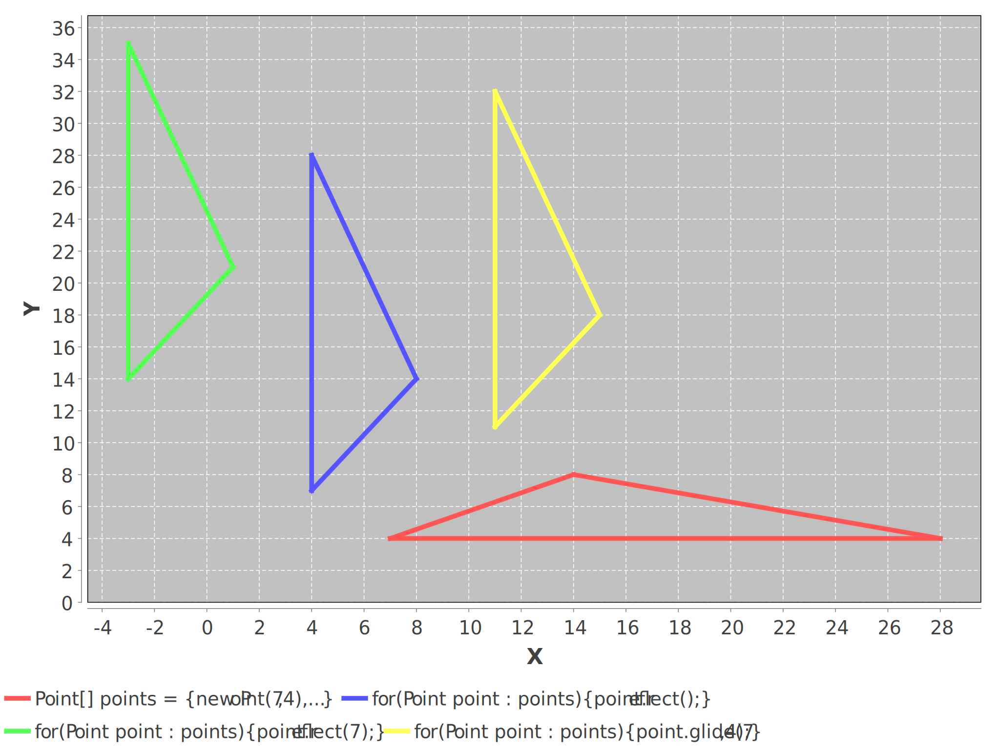

# Solver

An XY Point Class, ANSI text floor map generator and BFS maze solver.

This package runs under Java 8.

Dependencies: None, save

TestPoint and ChartIt use [JFreeChart](https://mvnrepository.com/artifact/org.jfree/jfreechart/1.5.3), [JCommons](https://mvnrepository.com/artifact/org.jfree/jcommon/1.0.24), and [JFreeSVG](https://mvnrepository.com/artifact/org.jfree/jfreesvg/3.4).

These dependencies are used for testing only, and not required to use the package.

## Sample random floor map creation:

```
solver.CreateMap.main();

Width = 18 Height = 13
------------------
|                |
|   *       *    |
|   *  * *  *    |
|   *    * **    |
|  ***   *  *    |
|        *  *P*  |
|        *  *    |
|        *  *  * |
|   K    *  *    |
|        *  * D  |
|        *  *    |
------------------
```


## Sample floor map solver solution:

```
SolveMap.main(random_floor_map.txt);
------------------
|     ........   |
|   * .     *.   |
|   * .* *  *.   |
|   * .  * **.   |
|  ***.  *  *.   |
|   ...  *  *P*  |
|   .    *  *..  |
|   .    *  * .* |
|   K    *  * .  |
|        *  * D  |
|        *  *    |
------------------

Kiva Commands:
FFFRFFLFFFFFRFFFFFFFRFFFFFTFLFRFFFD

Process finished with exit code 0
```

The robot (Kiva) gets a pod at point P and drops it off at the drop zone D.

## Sample maze solver solution:

```
SolveMap.main(maze1.txt)

----------
|K....   |
| ***.** |
| * .. * |
| * .* * |
| **.****|
| * ..   |
| * *. * |
|****.***|
|   *...P|
| *    * |
----------

Process finished with exit code 0
```

## Point Tests:

### Constructors

```java
********** POINT TESTS **********

a = 6, b = 3

********** TEST CONSTRUCTORS **********

Point origin = new Point();
Expect (0,0) 
Result (0,0)

Point point = new Point(6,3);
Expect (6,3) 
Result (6,3)

point.getReference(); // Reference is null.
Expect null 
Result null

Point pointWithReference = new Point(6,3,origin);
Expect (6,3) 
Result (6,3)
Point pointWithReference.getReference();
Expect (0,0) 
Result (0,0)

point.getX(); point.getY();
Expect 6,3 
Result 6,3 


Process finished with exit code 0
    
    
```

### Setters

```Java
********** POINT TESTS **********

a = -6, b = -3

********** TEST SETLOCATION, SETX, SETY SETREFERENCE **********

Point point = new Point(-6,-3);
Expect (-6,-3) 
Result (-6,-3)

Point q = new Point(-12,-6);
Expect (-12,-6) 
Result (-12,-6)

q.setLocation(point);
Expect (-6,-3) 
Result (-6,-3)

point.setLocation(-12,-6);
Expect (-12,-6) 
Result (-12,-6)

point.setReference(a,b);
Expect [(-12,-6),(-6,-3)] 
Result [(-12,-6),(-6,-3)]

q.setReference(point);
Expect [(-12,-6),(-6,-3)] 
Result [(-12,-6),(-6,-3)]

point.setX(-6); 
point.setY(-3);
Expect (-6,-3) 
Result (-6,-3)


Process finished with exit code 0
```

### Translate


```java
********** POINT TESTS **********

a = -6, b = 4

********** TEST TRANSLATE, MOVE, MOVEBY  **********

Point point = new Point(-6,4);
Expect (-6,4) 
Result (-6,4)

point.translate(-6,4);
Expect (-12,8) 
Result (-12,8)

Point q = new Point(-6,4);
Expect (-6,4) 
Result (-6,4)

point.translate(q);
Expect (-12,8) 
Result (-12,8)

point.move(-6,4);
Expect (-6,4) 
Result (-6,4)

Point r = point.moveBy(-6,4);
Expect (-6,4) 
Result (-6,4) (point)
Expect (-12,8) 
Result (-12,8) (r)

Point s = point.moveBy(q);
Expect (-6,4) 
Result (-6,4) (point)
Expect (-12,8) 
Result (-12,8) (s)

Point[] points = {new Point(-6,4),
                new Point(-12,8),
                new Point(-24,4),
                new Point(-6,4)};
Expect [(-6,4), (-12,8), (-24,4), (-6,4)] 
Result [(-6,4), (-12,8), (-24,4), (-6,4)]

for(Point point : points){
    point.translate(4,-6);
}
Expect [(-2,-2), (-8,2), (-20,-2), (-2,-2)] 
Result [(-2,-2), (-8,2), (-20,-2), (-2,-2)]


Process finished with exit code 0
```

### Reflect

Note: This method can convert `(row,col)` in an `array[][]` to `(x,y)`.



```
********** POINT TESTS **********

a = 3, b = 2

********** TEST REFLECT **********

Point point = new Point(3,2);
Expect (3,2) 
Result (3,2)

point.reflect();
Expect (2,3) 
Result (2,3)

point.getReference();
Expect (3,2) 
Result (3,2)

Point[] points = {new Point(3,2),
                new Point(6,4),
                new Point(12,2),
                new Point(3,2)};
Expect [(3,2), (6,4), (12,2), (3,2)] 
Result [(3,2), (6,4), (12,2), (3,2)]

for(Point point : pointsArray){
    point.reflect();
}
Expect [(2,3), (4,6), (2,12), (2,3)] 
Result [(2,3), (4,6), (2,12), (2,3)]


Process finished with exit code 0

```

